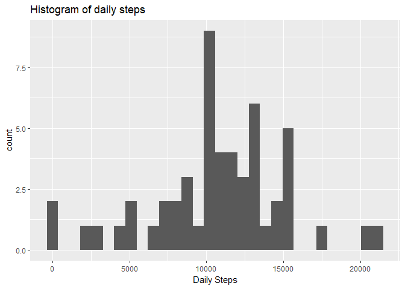
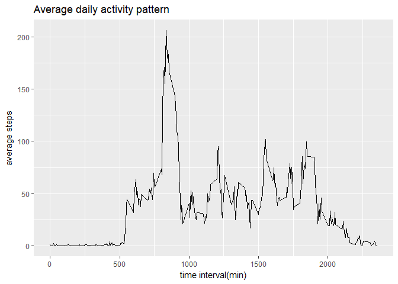
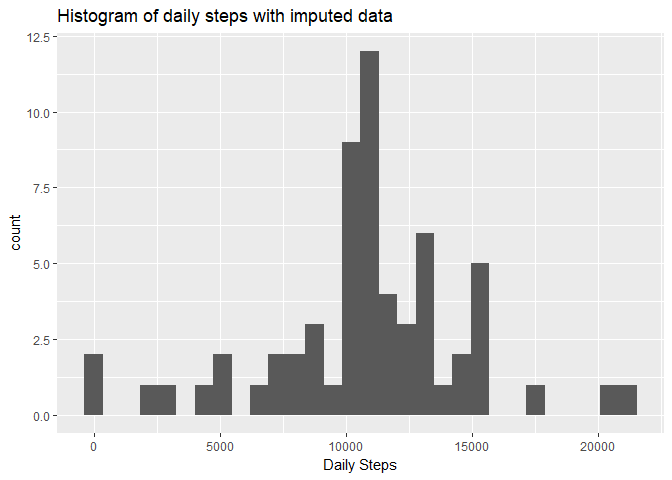
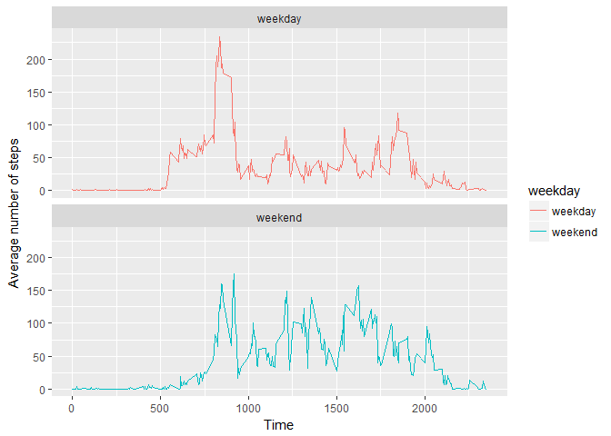

Load data file, relevant libraries and convert the steps column of the data into numeric.
-----------------------------------------------------------------------------------------

``` r
echo=TRUE
setwd("~/RProjects/Coursera/ReproducibleResearch Course5")
ActivityData<-read.csv("activity.csv")
library(dplyr)
```

    ## 
    ## Attaching package: 'dplyr'

    ## The following objects are masked from 'package:stats':
    ## 
    ##     filter, lag

    ## The following objects are masked from 'package:base':
    ## 
    ##     intersect, setdiff, setequal, union

``` r
library(ggplot2)
ActivityData <- ActivityData %>% mutate(steps = as.numeric(steps))
```

Q1. Calculate the total number of steps taken per day, create a histogram and show statistics based on totalnumber of steps per day.
------------------------------------------------------------------------------------------------------------------------------------

``` r
DailySteps <- ActivityData %>% group_by(date) %>% summarise(sum(steps))
ggplot(data=DailySteps, aes(x=`sum(steps)`)) + 
  geom_histogram() + 
  ggtitle("Histogram of daily steps") + 
  labs(x="Daily Steps")
```

    ## `stat_bin()` using `bins = 30`. Pick better value with `binwidth`.

    ## Warning: Removed 8 rows containing non-finite values (stat_bin).



``` r
 summary(DailySteps)
```

    ##          date      sum(steps)   
    ##  2012-10-01: 1   Min.   :   41  
    ##  2012-10-02: 1   1st Qu.: 8841  
    ##  2012-10-03: 1   Median :10765  
    ##  2012-10-04: 1   Mean   :10766  
    ##  2012-10-05: 1   3rd Qu.:13294  
    ##  2012-10-06: 1   Max.   :21194  
    ##  (Other)   :55   NA's   :8

Median steps per day = 10765 Mean steps per day = 10766

Q2. What is the average daily activity pattern?
-----------------------------------------------

``` r
Pattern <- ActivityData %>% na.omit %>% group_by(interval) %>% summarise(average = mean(steps))
Pattern %>% ggplot(aes(x=interval, y=average)) + geom_line() + labs(title = "Average daily activity pattern", x = "time interval(min)", y= "average steps")
```



``` r
Pattern %>% filter(average == max(average))
```

    ## # A tibble: 1 x 2
    ##   interval  average
    ##      <int>    <dbl>
    ## 1      835 206.1698

The 5-minute interval of 835 minutes contains the maximum number of steps.

Q3. Imputing missing data
-------------------------

First, the total number of missing values (NA's) in the dataset is calculated.

``` r
sum(is.na(ActivityData$steps))
```

    ## [1] 2304

The total number of missing values:2304

Replacing NA's in the dataset was done by calculating the interval mean using the existing data, then replacing the NA's with those calculated means.

``` r
imputedAD <- ActivityData %>% group_by(interval) %>% mutate(impute_steps = mean(steps, na.rm=TRUE))
imputedAD$steps[is.na(imputedAD$steps)] <- imputedAD$impute_steps[is.na(imputedAD$steps)]
```

Create dataset with total steps per day with imputed data and create histogram. Report mean and median total steps per day and compare to mean and median with original dataset.

``` r
TotalImputed <- imputedAD %>% group_by(date) %>% summarise(allImputed = sum(steps, na.rm=TRUE))
summary(TotalImputed)
```

    ##          date      allImputed   
    ##  2012-10-01: 1   Min.   :   41  
    ##  2012-10-02: 1   1st Qu.: 9819  
    ##  2012-10-03: 1   Median :10766  
    ##  2012-10-04: 1   Mean   :10766  
    ##  2012-10-05: 1   3rd Qu.:12811  
    ##  2012-10-06: 1   Max.   :21194  
    ##  (Other)   :55

``` r
ggplot(data=TotalImputed, aes(x=allImputed)) + 
  geom_histogram() + 
  ggtitle("Histogram of daily steps with imputed data") + 
  labs(x="Daily Steps")
```

    ## `stat_bin()` using `bins = 30`. Pick better value with `binwidth`.



The imputed data appeared to have a higher impact on the 1st quartile with only a 1 point increase in the median and no change to the mean.

Q4. Are there differences in activity patterns between weekdays and weekends?
-----------------------------------------------------------------------------

``` r
ActivityData$weekday <- ifelse(weekdays(as.Date(ActivityData$date)) %in% c("Saturday","Sunday"),"weekend", "weekday") 

StepsByDay <- ActivityData %>% group_by(interval, weekday) %>% summarize(average = mean(steps, na.rm=TRUE))

ggplot(StepsByDay, aes(x=interval, y=average, colour = weekday)) + geom_line() +
     facet_wrap(~weekday, ncol=1)  +
    labs(x="Time", y = "Average number of steps" )
```


